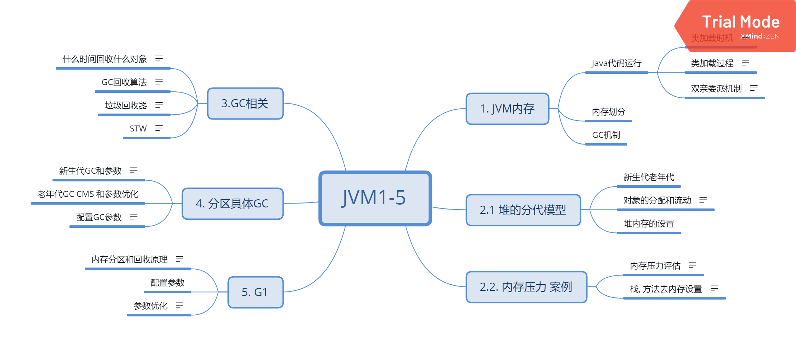

## Week5 G1

### 29. G1的工作原理

1. ParNew+CMS组合:
parnew和CMS都会STW, 所以G1诞生, 可以提供比`ParNew+CMS`更好的GC性能.

2. G1 collector
	1. G1同时回收新生代老年代. 把**Heap拆分成多个大小相等的Region**.
		新生代和老年代变成了**逻辑概念**
		
	2. 可以设置**垃圾回收的预期停顿时间**: 规定每个小时内由GC导致的STW时间不超过xxx, 可以限制GC的影响了

3. G1的可控停顿: 核心思路
   追踪每个region的回收价值. **每个Region有多少垃圾, 回收耗时估计**.

4. 老年代, 新生代
	每个region可能属于新生代, 也可能属于老年代. 
	初始的Region不属于任何, 被分配给了新生代, 然后放新生代Obj, 最后出发G1回收这个region. 下一次可能又被分配到了老年代, 放老年代的Obj.
	G1对应的内存模型, **新生代和老年代各自的内存区域由G1控制不断地变动.**

5. 思考题:
   > 线上有没有用G1, G1效果如何?
   > 答: 生产上的项目用了G1, DEV和UAT上没有用. 

### 30. G1回收原理
1. 如何设定G1内存大小
   G1需要多少个Region, 每个Region大小是多少?

   自动计算和设置的, `-XX:UseG1GC` + `-Xms/-Xmx`配置堆大小, 会自动用Heap/2048. JVM最多有2048个Region, 每个region必须是2的倍数(1MB/2MB/...)
	使用默认的region数量就好. 也可以`-XX:G1HeapRegionSize`配置Region大小.

	新生代初始默认占比5%, 可以用`-XX:G1NewSizePercent`配置占比. 默认即可. 因为G1运行过程中不断给新生代配置更多Region. 最多不超过60%. `-XX:G1MaxNewSizePercent`配置.

2. 新生代的Eden和Survivor概念:
   
   之前的技术原理在G1也有用. `-XX:SurvivorRatio=8` 可以区分新生代的Eden和Survivor的Region占比. 

3. G1新生代垃圾回收:
   
   新生代的垃圾回收机制类似之前学的, 新生代的Eden包含的Region中对象越来越多, JVM为新生代分配更多的Region. 在达到上面的新生代占比临界值, 就出发MinorGC, 使用复制算法, ParallelNew STW. 把Eden存活对象放到S1里面.
   

   区别是: G1有STW限制的, 会对每个Region的回收和时间做评估. 尽量回收多的.

4. 存活对象进入老年代

	和之前几乎一样:
	1. 对象正常存活, 达到年龄. `-XX:MaxTenuringThreshold`
	2. 动态年龄判断, 在MinorGC后Survivor有一半以上的同龄对象, 之上的就进入老年代.
	
5. 大对象Region
   
   G1提供了专门的Region存放大对象, 而不是让大对象进入老年代的Region.

   超过一个Region的50%就被判定大对象, 比如2MB的region, 1MB以上的就会放入大对象专用Region. 大对象可能占用多个region.

   动态分配的region会有一部分放大对象, MinorGC和FullGC会顺带大对象Region一起回收.

6. 思考: 
   > 新生代的GC, G1比ParNew先进在哪里:
   > 我觉得是可控STW, 追踪了每个region的垃圾, 可以每次回收效率很高. 

### 31. G1的参数设置

1. 新生代+老年代的混合回收 什么时候触发
   
   `-XX:InitiatingHeapOccupancyPercent` 的回收阈值, 老年代达到了堆的百分比(默认45%) 会触发MinorGC+FullGC. 
   

2. G1回收过程
   
   1. 首先出发`初始标记(STW)`, 只会标记GCRoots直接引用对象, 速度很快. 
		
   
   2. 然后进入`并发标记(no STW)`, 从GCRoot追踪存活对象. 耗时比较长. 但是不影响工作. 会对并发阶段的对象修改做记录(新建对象/新垃圾对象)
   3. `最终标记(STW)`, 根据并发标记阶段的修改记录做确认, 存活对象垃圾对象.
   4. `混合回收(STW)`, 对每个Region的存活对象, 回收时间预估, 只会选择部分Region, STW回收.
   5. 回收范围: 老年代, 新生代和大对象Region

3. G1 参数
   
   其实混合回收阶段会伴随多次回收, 从新生代, 老年代都回收一些Region, STW回收一些, consume to work, STW再回收一些.  `-XX:G1MixedGCCountTarget`控制混合回收最后的混合阶段执行多少次混合回收, 默认8次. 让系统不会停顿太长.
   比如160个region, 8次, 每次会回收20个. 
   

	`-XX:G1HeapWastePercent` 默认5%, **混合回收的算法都是复制算法回收**, 把region里面存活的放到一个region里, 干掉老的region. 一旦空闲出了5%的region, 停止混合回收.

	`-XX:G1MixedGCLiveThresholdPercent`, 是存活对象低于这个百分比的region才会回收. 默认85%. 不然的话复制算法代价很高.

4. MixedGC回收失败时的FullGC
   
   在MixedGC回收中, 一旦发现没有空闲的Region承载复制算法的时候, 就会STW, 单线程标记-清理-压缩整理. 极慢的.

5. 思考题:
   > 结合之前针对`ParNew + CMS`的GC优化思路:
   > 使用G1时候应该优化的是什么地方? 如何会造成和减少MixedGC频率?
   > 1. 没思路, 感觉人家动态分配Region, 不用我们之前的优化了
   > 2. 老年代太大会造成MixedGC, 增大那个阈值会减少. 适当减小容忍的停顿时间.

### 32. G1优化案例 - 高并发流量平台
流量平台, 我们的订阅服务, 每次洪峰集中在周一. 有用户高频大量的请求. 
比如每秒3k请求, 每个请求创建一些记录对象伴随系统, 每个请求大概会在JVM里面创建5KB对象, 每台机器每秒600并发占用3MB内存. 

4核8G机器, 每个JVM5G, Heap4G. 新生代初始占比5%, 最大60%, 线程占内存1MB, MetaSpace256M. 

> -Xms4096M -Xmx4096M -Xss1M -XX:PermSize=256M -XX:MaxPermSize=256M -XX:PermSize=256M -XX:+UseG1GC
> 堆总共4G, 2048个region, 每个2MB, 新生代初始100个Region.

1. GC停顿时间如何设置: `-XX:MaxGCPauseMills`
   
   每次的停顿时间阈值, 默认200ms. 先保持默认.

2. 多久出发新生代GC
   
   每秒创建3MB, 大概一分钟塞满100个Region. 会继续增加region.
   增加到n个region之后, 评估发现现在回收的话可能大概需要200ms, 然后就不增加进行回收了. 但是, 这些都是不确定的. 

3. 新生代GC如何优化
   
   首先给足够的Heap空间
   然后合理设置`-XX:MaxGCPauseMills` 过小会让GC频率过高, 过大单词停顿时间会长. 

4. MixedGC优化
   
   MixedGC触发实在老年代超过45%的时候, 那么就要尽量少的阻止对象进入老年代. 

   动态年龄判断和新生代GC后的对象太多被放入老年代. 

   首先还是`-XX:MaxGCPauseMills`, 不要让新生代GC间隔 过长, 导致存活的对象太多放入老年代. 

5. 思考
   > G1在什么场景下适用? 有了G1之后什么场景还适用ParNew+CMS?
   > 感觉G1在什么场景都适用. ParNew主要是复制算法停顿短, 但是G1复制算法也一样短啊.

### 34. 作业: 第一阶段复习, 系统部署如何设置JVM参数

TODO 复习作业, 对五周内容座署理. 

### 35. 经典问题:

1. 30G的大Heap使用的G1, 传统回收期可能造成很大的停顿. **G1更适合超大内存**, 可以指定停顿时间, 回收一部分Region.
2. G1特点是STW可预测, 把内存分成Region, 并进行回收价值判断, **更适合用在STW敏感业务**.

