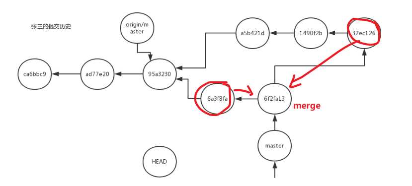

[GIT学习资料](http://cs-cjl.com/)

### 1. 什么是版本控制系统 以及Git前世今生

每次修改, 就是一个全新的版本. 管理版本的系统就是版本控制系统.

- 记录下修改历史的每一个版本. 
- 版本的回退, 差异比较等功能.

几种版本控制系统:

1. 本地版本控制系统: RCS等, 维护每个版本之间的修改Path. 80年代
2. 集中式版本控制系统: CVS, SVN: 单点故障. 从服务器拉取部分.
3. 分布式版本控制: 每个人本地都有完整代码版本的拷贝, 每个计算机都是一个完整的系统. 


### 02. 案例背景引入: OA系统代码管理

OA系统的代码没有做任何的代码的版本控制. 就用这个.


### 03. 安装和配置Git

配置: 

1. `git config --system` 配置`/etc/gitconfig`,对机器上的git项目生效.
2. `git config --global` 配置`~/.gitconfig`, 对当前用户生效.
3. `.git`目录下的config文件, 对git项目生效.


### 04. Git托管OA系统代码

`git init`

`git add -all`

`git commit -m 'xxx'`


### 05. Git本地仓库结构

- 工作区: 目录下的
- 暂存区: 在版本库里, 叫做index. 下一次提交的文件
- 仓库, 版本库: .git的隐藏目录里, 存储元数据, 很当数据库
- 在工作区写代码, git-add之后放入暂存区, commit之后就放入版本库了.
- 手动修改.git存储数据后hash值变掉, git不承认.


### 06. git status查看代码状态

1. 文件状态转换:

   - untracked: 没有add的红色文件
   - new: 第一次add的文件
   - tracked:  提交到版本库的文件
   - modified: 已经被追踪, 有修改. 在add之前是changes not staged for commit
     - 如果add了, 就会变成 modified, 然后changes to be committed.
   - committed: commit之后的文件状态.

   三种文件状态: committed, modified, staged.

2. 修改的内容都需要add, 才能commit, 不管文件之前有没有.

3. add是把修改的文件放入暂存区. 每次add就是一个版本, **工作区中所有修改的文件，都作为一个新的版本，放入暂存区，这个版本等待被提交**

4. commit是把暂存区中的修改固定版本 放入版本库. 

   git add和git commit都是一起执行的. 所以commit感觉是一个版本.


### 07. 基于git log查看以及深入图解Git提交历史

**git每次commit的对象, 分支, 和Head 的关系:** 


### 08. 结合Git提交历史用git reset体验多版本代码切换

reset 回退版本, 是不会删除之间的版本链条的. 之后还可以回来. 用`git reflog`可以查看Head的指针历史, 然后随便回就好了.


### 09. 基于远程Git仓库的多人开发


### 10. 基于centos搭建Git服务器

在服务器上面创建一个bare的没有工作区的裸仓库. 

在服务器上面创建git用户, 禁止shell登录

在本地, 连接好服务器的git仓库, clone下来. `git remote add origin ssh://git@192.168.31.244:/srv/oa-parent.git`


### 11. 分支原理 和 工作流**

**之前是: 三个区域(工作区, 暂存区, 版本库), 六种状态:(committed, new, untracked, tracked...), Commit历史和branch和Head的关系.**

现在是: 分支的原理, 合并的原理, 冲突的解决, 远程分支和本地分支的关系.

#### **分支的原理: 分支就是指针.**

多次提交就会得到一个commit历史(树形结构??), 每个commit都是一个Obj记录着id和修改快照内容. 

分支就是一个指向commitObject的指针. 拉去不同的分支就是创建不同指针, 来创建和维护commitObj树.

- 创建, 切换分支: git branch, checkout 

- 远程分支: `git push -u origin name`push一个新的. 抓取 git fetch.

  clone的时候默认关联起来.

#### commitObject 内容

git的单元commitObject不存储文件差异, 而是一系列文件快照.每个commitObj指向上一个commitObj, 所以形成树.

**每次把文件放入缓存区(add), 文件内容打包成blob,计算成hashId, git就创建一个commitObject. 有: 一个tree指向每个修改文件的blob.**

我的理解: IDEA里面我们写的东西, 都在工作区, 点击commit就是add+commit.

#### git 工作流

多个人基于远程Git仓库进行协作开发. 

- 集中式工作流:  看15章介绍.

- 功能分支工作流: 小团队: feature, breakfix, master分支.

  

  还有develop分支, 用于集成测试之类的. 创建一个分支就是创建一个指针. 

- GitFlow工作流: 看17章介绍.


#### merge:

- **fast-forward merge**: 在只有一个子分支, 然后merge子分支的新commit, 就直接把master的指针指向子分支的新commit就好了. 不会有其他的冲突, 只需要commit_log接着往前. 

- **3-way merge**, 合成新的版本, commitObject父节点有两个.

  

  

  

### 远程分支操作内幕

**push到original的时候, 就会:** 

- 移动本地的"origin/master"指针到本地的master指针处. 
- 把本地的commitObj和文件内容交到origin.

**如果远程有更新, 需要pull, merge:**

- 把远端的commitObj都拉下来
- 把本地的master指针的commitObj和origin/master的commitObj进行3-way merge.
- master指向新的版本

#### 分支冲突合并

3-way merge出现了冲突, 就是干掉重新生成版本就好了


### 14. 私有GitLab服务器

1. 安装GitLab, 防火墙开启SSH和Http访问. 


### 15. 面向极小团队的集中式工作流

- 集中式工作流: 1~2 个人单独维护的项目

  两个人共用一个master分支, 非常简单的小项目.


总结: 

- 再次强调: 版本库管理就是每个版本是一个commitObj, 构成树, 分支就是一个指针. 
- push就是把本地的历史树推到远程. 
- 如果两个分支的历史树不一样, 就需要merge.


### 16. 基于Rebase优花集中式工作流的提交历史

rebase：变基, 把其他的分支merge进来, 优化集中式工作流的提交历史成为一条线. 会把老的commitObj改变新的CommitObj, 把历史捋成直线.


### 17. 版本稳定迭代的[GitFlow工作流](https://www.jianshu.com/p/a6cc4499aa4b)

主要在*版本稳定迭代*的中小型项目用. 主要是成熟稳定.

- 由master分支作为生产上线分支, 每次上线打tag.

- develop作为公共的代码集合, 一个节点到了就拉一个release分支去测试.

  release分支测试好, 合到master分支上生产了.

- feature分支从develop上拉下来. 开发自测完成之后再合到develop上.

- > **feature开发完后干掉, release合并完后干掉. develop持续集成, master稳定上线.**

**问题**: 从develop分支上拉一个release分支, 如果develop上面有一些代码不想上线呢? 


**GitFlow的优缺点:**

适合稳定版本的.

- **如果是快速迭代的版本, develop分支会极其不稳定. 把多个版本混在一起测试了.** 


### 18. GitFlow基于版本开发 适应多版本并行场景

- master的稳定和基准不变, 把一个总的develop干掉. 
- 基于master启动一个版本. 基于master开一个基于版本范围内的develop. 然后同一个版本用着一个develop.
- **版本的develop好了之后, 集成测试, 好了之后merge到master形成新的staging分支, 进行回归测试. 好了之后版本就完成了, master就稳定了.** 
- **开发基于版本, 版本是独立的, 是基于最稳定的master**


### 19-30: Git各种操作技巧

#### 19. 比较两个分支的不同, commit差异

1. 一般不用40位, 7位表示commit就好了.

#### 20. 比较两个分支的不同, 代码.

- `git diff Head`, `git diff Head Head^` 分别查看还没有commit的代码, 最近一个commit的内容.

#### 21. 将暂存区中的多个功能代码分成多次提交

如果错误的把所有的代码add了, 都跑到了暂存区, 应该把代码取出来到工作区, 分成多次提交.

`git add -i`这个会展示暂存区里面的.

`git revert`命令把文件从暂存区里面挪出来, 要用命令行, Idea会在工作区干掉文件.

#### 22. 开发到一半 切换分支 stash 存起来

`git stash` 可以存起来工作区没有add的代码. 下次放出来就好了.

默认只stash那些tracked的文件. 

`git stash --index --include-untracked`, 就是将暂存区中的内容 和 工作区的文件修改 都stash.

#### 23. 修改本地不规范的提交历史

- 修改最近一次commit: `git commit --amend`重新备注, 如果有漏修改的代码也在命令之前修改好. 

  本质就是改掉一个commitObject

- 删除和调整commit顺序

- 拆分1个commit为多个.

#### 24. 撤回本地的修改, 暂存, 提交

- 舍弃工作区里面的修改

  reset 命令.

  

#### 25. 远程和本地同时撤回分支合并操作.

- merge出现冲突的时候: `git merge --abort` 取消merge
- 本地merge之后想回撤: `git reset HEAD^`把指针调回去.

- push上去的merge想回撤: `git revert -m 1 HEAD` 创建一个新的commitObject和合并之前的CommitObject内容一样. 此时再Merge是Merge不回去的.

- push后回撤之后还想merge, 那么应该`git revert Head`回到上次merge那里, 然后再merge就好了.

  

#### 26. 二分查找定位代码来自于某次提交

- `git blame`查找代码在哪几次commit有修改

- `git bisect start` 开始二分查找

  

#### 27. submodel/subtree 多个项目共享一个子项目

`git submodule add git@192.168.31.80:OA/DbConnector.git`


#### 28. 迁移项目时候简化提交历史

`echo 'xxx' | git commit-tree 9c68fdc^{tree}` 从9c68fdc这个commit的tree为基准commit. 

之前的日志都没有了.


#### 29. 将新版本功能放到上一个版本提前上线.

找到想要的几个commit.

- 使用`cherry pick`来把几个commit复制到对应的版本里.

  ```shell
  git checkout feature/v1.0
  git cherry-pick feature/v1.1分支对应的多个commit标识
  ```

#### 30. 基于GitLab的代码权限控制

- master分支的push权限.
- 仓库的分支写权限, private, 限定成员.guest权限.
- 强制pull request的code review.


### 31. Git原理: 深入Git的引子介绍


